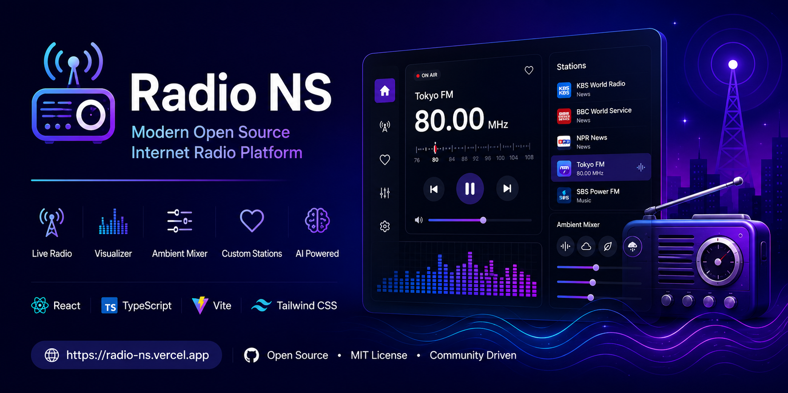

<div align="center">

<p align="center">
  
</p>

# 📻 Radio NS

### Modern Open Source FM, AM & Internet Radio Platform

Discover, listen, and enjoy radio stations from around the world with a beautiful modern interface.

[](LICENSE)


### 🌐 Live Demo

https://radio-ns.vercel.app/

⭐ If you like this project, please consider giving it a Star!

</div>

---

# 📖 Overview

Radio NS is an open-source web application that brings traditional radio into the modern web experience.

Instead of providing only a simple radio player, Radio NS is designed as a next-generation listening platform featuring a realistic radio tuner, customizable stations, immersive ambient sound mixing, live audio visualization, and an AI-ready architecture for future intelligent radio experiences.

The long-term goal of this project is to become one of the world's most complete open-source radio platforms.

---

# ✨ Features

## 📻 Radio

- Internet Radio Platform
- Internet Radio
- Custom Radio Stations
- Favorite Stations
- Fast Station Switching

---

## 🎛 User Experience

- Modern Radio Tuner
- Responsive Interface
- Smooth Animations
- Dark Theme
- Mobile Friendly

---

## 🎵 Audio

- Ambient Sound Mixer
- Acoustic Control Panel
- Live Audio Visualization
- High Quality Streaming

---

## ⚡ Performance

- Fast Loading
- Lightweight
- Built with Vite
- Optimized React Components

---

## 🤖 AI Ready

Future AI features include:

- AI DJ
- AI Station Search
- AI Voice Assistant
- Live Translation
- Program Summaries
- Smart Recommendations
- Voice Commands

---

# 🖼 Screenshots

> Screenshots will be added soon.

Example:

```
assets/

    screenshot-home.png

    screenshot-player.png

    screenshot-mobile.png

    demo.gif
```

Later you can display them like this:

```markdown
## Home


## Player


## Mobile


## Demo


```

---

# 🚀 Why Radio NS?

Many radio applications have outdated interfaces and limited functionality.

Radio NS focuses on:

- Beautiful User Experience
- Open Source Development
- Cross Platform Compatibility
- Modern Web Technologies
- AI Integration
- Accessibility
- Community Contributions

---

# 🌍 Vision

Our mission is to modernize radio listening while keeping the simplicity and charm of traditional radio.

Radio NS aims to become an open platform where developers can build new listening experiences powered by modern web technologies and artificial intelligence.
---

# 🚀 Getting Started

Follow these steps to run Radio NS on your local machine.

## Prerequisites

Before starting, make sure you have installed:

- Node.js (18 or later recommended)
- npm (comes with Node.js)

You can verify your installation:

```bash
node -v
npm -v
```

---

# 📥 Installation

Clone the repository.

```bash
git clone https://github.com/Ninja-Subak/radio-ns.git
```

Move into the project folder.

```bash
cd radio-ns
```

Install all dependencies.

```bash
npm install
```

---

# ⚙ Environment Variables

Create a file named:

```
.env.local
```

Add your API key.

```env
GEMINI_API_KEY=YOUR_API_KEY
```

> Never commit your API key to GitHub.

---

# ▶ Running the Development Server

Start the development server.

```bash
npm run dev
```

Then open your browser.

```
http://localhost:5173
```

---

# 📦 Production Build

Build the application.

```bash
npm run build
```

Preview the production build.

```bash
npm run preview
```

---

# 🛠 Tech Stack

Radio NS is built using modern web technologies.

| Technology | Purpose |
|------------|---------|
| React | User Interface |
| TypeScript | Type Safety |
| Vite | Build Tool |
| HTML5 Audio | Streaming |
| CSS3 | Styling |
| Gemini API | AI Features |
| Vercel | Deployment |

---

# 📂 Project Structure

```
radio-ns/

├── assets/
│
├── src/
│   ├── components/
│   │     AcousticPanel.tsx
│   │     AddStationForm.tsx
│   │     AmbientMixer.tsx
│   │     LiveVisualizer.tsx
│   │     PresetGrid.tsx
│   │     RadioTuner.tsx
│   │
│   ├── data/
│   │     stations.ts
│   │
│   ├── utils/
│   │     audioEngine.ts
│   │
│   ├── App.tsx
│   ├── main.tsx
│   ├── index.css
│   └── types.ts
│
├── package.json
├── vite.config.ts
└── README.md
```

---

# 📚 Component Overview

## RadioTuner

The main radio tuning interface.

Features:

- Station tuning
- Frequency display
- User interaction

---

## LiveVisualizer

Displays animated audio visualization while playing radio streams.

Features:

- Live animation
- Smooth rendering
- Lightweight

---

## AmbientMixer

Adds environmental sounds to create an immersive listening experience.

Examples include:

- Rain
- Wind
- Nature
- Café ambience

---

## AcousticPanel

Provides advanced sound controls for the listener.

Examples:

- Volume adjustment
- Audio balance
- Future equalizer support

---

## AddStationForm

Allows users to add custom radio stations.

Supports:

- Station name
- Stream URL
- Category
- Country

---

## PresetGrid

Displays favorite and preset stations for quick access.

Features:

- One-click playback
- Organized layout
- Easy management

---

# 🎵 Audio Engine

The audio engine is responsible for:

- Streaming internet radio
- Managing playback
- Handling buffering
- Controlling volume
- Synchronizing visualizer

Future improvements include:

- Gapless playback
- Equalizer
- Audio effects
- Sleep timer
- Crossfade
- ---

# 🌟 Core Features

Radio NS is more than a traditional radio player.

It is designed to become a modern listening platform that combines classic radio with today's web technologies.

## 📻 Global Radio

Listen to radio stations from around the world.

Future versions will include:

- Country filtering
- Language filtering
- Genre filtering
- Trending stations
- Community recommendations

---

## ❤️ Favorites

Users can quickly save their favorite stations.

Planned improvements:

- Cloud synchronization
- Import / Export
- Multiple collections
- Recently played stations

---

## 🔍 Smart Search

Find stations quickly by:

- Name
- Country
- Language
- Genre
- Popularity

Future AI-powered search will allow natural language queries such as:

> "Find relaxing jazz stations from Japan."

or

> "Show English news radio."

---

## 🎵 Ambient Listening

Radio NS includes an ambient sound mixer for immersive listening.

Possible sound presets:

- Rain
- Thunder
- Forest
- Fireplace
- Ocean
- Café
- Wind
- Night ambience

Users can mix environmental sounds with live radio streams.

---

## 📈 Live Audio Visualization

Visual feedback enhances the listening experience.

Future visualizer styles:

- Spectrum Analyzer
- Waveform
- Circular Visualizer
- Neon Bars
- Vintage Radio Meter
- Dynamic Background Effects

---

# 🤖 AI Roadmap

Artificial Intelligence is a major part of the future vision of Radio NS.

Upcoming AI-powered features include:

## 🎙 AI Radio DJ

An AI assistant capable of:

- Introducing stations
- Reading news summaries
- Announcing weather
- Speaking between songs
- Personalized recommendations

---

## 🌎 Live Translation

Translate live radio programs into multiple languages.

Potential support:

- English
- Korean
- Japanese
- Spanish
- French
- German

---

## 📝 Program Summaries

Long talk shows can automatically be summarized into key points.

Benefits:

- Save time
- Catch important news
- Improve accessibility

---

## 🎧 AI Recommendations

Radio NS will learn user preferences and recommend stations based on:

- Listening history
- Favorite genres
- Time of day
- Seasonal trends

---

## 🎤 Voice Commands

Examples:

> Play jazz radio

> Open BBC News

> Find Korean FM stations

> Start relaxing ambient mode

---

# 📱 Progressive Web App (PWA)

Radio NS is designed with Progressive Web App support in mind.

Future capabilities include:

- Install on desktop
- Install on Android
- Offline interface
- Push notifications
- Background playback

---

# ⚡ Performance Goals

Radio NS focuses on performance.

Goals include:

- Fast startup
- Lightweight bundle
- Efficient rendering
- Low memory usage
- Smooth animations

---

# 🔒 Security

Security is important for both developers and users.

Future improvements include:

- Secure API integration
- Input validation
- Stream verification
- Dependency updates
- Vulnerability monitoring

---

# 🌍 Accessibility

Radio NS aims to be usable by everyone.

Future accessibility improvements:

- Screen reader support
- Keyboard navigation
- High contrast mode
- Adjustable font size
- Voice navigation

---

# 🌱 Open Source Philosophy

Radio NS is developed as an open-source project because great software grows through community collaboration.

Everyone is welcome to:

- Report bugs
- Suggest new ideas
- Improve documentation
- Submit pull requests
- Help translate the project
- Review code
- Share feedback

Every contribution helps make Radio NS better.

---

# 🚀 Future Roadmap

## Version 1.x

- Stable radio player
- Favorite stations
- Custom stations
- Improved UI

---

## Version 2.x

- Cloud sync
- User accounts
- Better search
- Radio categories
- Sleep timer

---

## Version 3.x

- AI DJ
- AI Translation
- AI Recommendations
- AI Search
- AI Summaries

---

## Version 4.x

- Android App
- iOS App
- Desktop App
- Smart TV Support
- Wear OS

---

## Long-Term Vision

Radio NS aims to become one of the world's leading open-source radio platforms by combining modern web technologies, artificial intelligence, and community-driven development.

Our vision is to make radio more accessible, more interactive, and more enjoyable for everyone.
---

# 🤝 Contributing

Contributions are welcome!

Whether you're fixing bugs, improving documentation, designing UI components, or proposing new features, your help is appreciated.

## How to Contribute

1. Fork this repository.
2. Create a feature branch.

```bash
git checkout -b feature/my-new-feature
```

3. Commit your changes.

```bash
git commit -m "Add amazing feature"
```

4. Push to your branch.

```bash
git push origin feature/my-new-feature
```

5. Open a Pull Request.

Please read **CONTRIBUTING.md** before submitting contributions.

---

# 🐞 Reporting Bugs

If you discover a bug, please open a GitHub Issue.

When reporting a bug, include:

- Browser
- Operating System
- Steps to reproduce
- Expected behavior
- Actual behavior
- Screenshots (if available)

---

# 💡 Feature Requests

Have an idea?

Open a GitHub Discussion or create a Feature Request Issue.

Examples:

- New radio features
- Better UI
- More countries
- AI improvements
- Accessibility enhancements

---

# 🧪 Development

Useful commands:

Install dependencies

```bash
npm install
```

Start development server

```bash
npm run dev
```

Build production version

```bash
npm run build
```

Preview production build

```bash
npm run preview
```

---

# 📊 Project Status

Current Status

🟢 Active Development

Upcoming priorities

- Better station management
- More AI features
- Improved mobile support
- Better accessibility
- Community contributions

---

# 🌍 Community

We welcome developers from around the world.

You can contribute by:

- Writing code
- Improving documentation
- Translating the project
- Reporting issues
- Suggesting features
- Reviewing pull requests

---

# ❤️ Support the Project

If you enjoy Radio NS, please consider supporting the project.

You can help by:

⭐ Starring this repository

🐛 Reporting bugs

💡 Suggesting new ideas

🔀 Submitting Pull Requests

📢 Sharing the project with others

Every contribution helps make Radio NS better.

---

# 📜 License

This project is licensed under the MIT License.

See the LICENSE file for details.

---

# 🙏 Acknowledgements

Special thanks to:

- React
- TypeScript
- Vite
- Google Gemini API
- Vercel
- The Open Source Community

Their amazing tools make projects like Radio NS possible.

---

# ❓ Frequently Asked Questions

## Does Radio NS include FM and AM radio?

Yes.

Radio NS is designed to support FM, AM, and Internet Radio.

---

## Is this project open source?

Yes.

Everyone is welcome to contribute.

---

## Can I add my own radio stations?

Yes.

Custom station support is included and will continue to improve.

---

## Is AI required?

No.

Radio playback works without AI.

AI features are optional enhancements.

---

## Which browsers are supported?

Latest versions of:

- Chrome
- Edge
- Firefox
- Safari

---

## Can I use this project commercially?

Yes.

The MIT License allows commercial use.

Please review the LICENSE file for details.

---

# 📬 Contact

GitHub

https://github.com/Ninja-Subak/radio-ns

Live Demo

https://radio-ns.vercel.app/

---

# 🌟 Star the Project

If this project helped you, please consider giving it a ⭐ on GitHub.

Your support motivates future development.

---

<div align="center">

# 📻 Radio NS

### Modern Open Source Radio Platform

Built with ❤️ using React, TypeScript, and Vite.

Made for radio enthusiasts, developers, and the open-source community.

⭐ Thank you for visiting Radio NS!

</div>
